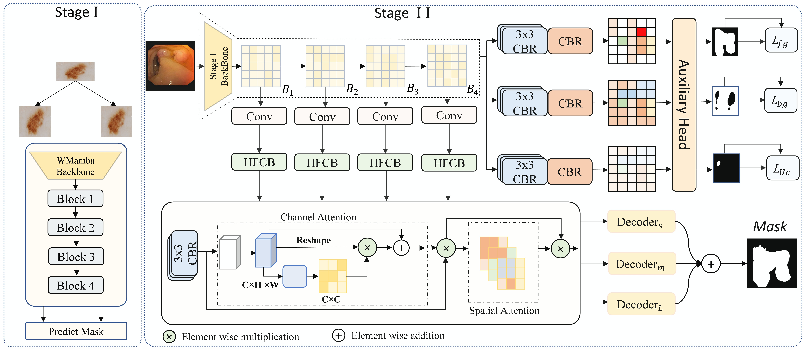

<h1 id="HyperSeg-DG">HyperSeg-DG: Multi-Scale Hyper Feature Context for Domain Generalized Medical image Segmentation</h1>

<p align="center">
  <!-- Adjust width as needed (e.g., 800–1100) -->
  
</p>
<p align="center"><em>Figure 1. The proposed HyperSeg-DG framework for segmentation and domain generalization.</em></p>

<h2 id="dataset">Dataset Preparation</h2>

<h3 id="ImageNet-1K">ImageNet-1K Dataset (Backbone Pre-training)</h3>

```bash
data/
├── imagenet/
│ ├── train/
│ │ ├── n01440764/
│ │ │ ├── n01440764_10026.JPEG
│ │ │ └── ...
│ │ ├── n01443537/
│ │ └── ... (1000 classes)
│ └── val/
│ ├── n01440764/
│ │ ├── ILSVRC2012_val_00000293.JPEG
│ │ └── ...
│ └── ... (1000 classes)
```

<h3>Segmentation Dataset (Stage-I & Stage-II)</h3>

```bash
data/
├── dataset_name/
│ ├── train/
│ │ ├── images/
│ │ └── masks/
│ ├── val/
│ │ ├── images/
│ │ └── masks/
│ └── test/
│ ├── images/
│ └── masks/
```

<h2 id="requirements">Requirements</h2>
<ul>
  <li>Python 3.9.21</li>
  <li>numpy==2.0.2</li>
  <li>pandas==2.2.3</li>
  <li>torch==2.6.0</li>
  <li>torchvision==0.10.0</li>
  <li>causal-conv1d=1.0.0</li>
  <li>mamba-ssm=1.0.0</li>
  <li>timm=0.6.12</li>
  <li>einops=0.6.1</li>  
</ul>

<h2 id="clone-repository">Clone Repository</h2>
<pre><code>git clone https://github.com/Pollob001/HyperSeg-DG.git
cd HyperSeg-DG
</code></pre>

<h2 id="Generated Pretrained Models">Generate Pretrained Models</h2>
<p>Download the generated backbone pretrained models from <a href="add_link_kaggle"><code>here</code></a>.</p>

<h3 id="Generate Backbone">Generate Backbone</h3>
<ul>
<li><strong>WMamba-T</strong>: Lightweight backbone for resource-constrained scenarios.</li>
<li><strong>WMamba-S</strong>: Balanced performance-efficiency trade-off.</li>
<li><strong>WMamba-B</strong>: Maximum accuracy for high-end systems.</li>
</ul>
<pre><code>python backbobe/train.py</code></pre>


<h2 id="stage-1">Stage-I</h2>
<li><strong>Stage-I</strong>: Pre-trains the WMamba backbone with auxiliary heads
<pre><code>python train_stage1.py</code></pre>

<h2 id="stage-2">Stage-II</h2>
<li><strong>Stage-II</strong>: End-to-end training with HyperSeg-DG component
<pre><code>python train.py</code></pre>

<h2 id="test">Test</h2>
<li><strong>Test</strong>: Evaluate the trained model
<pre><code>python test.py</code></pre>


<h2 id="Acknowledgements">Acknowledgements</h2>
<p>
  This project builds upon the following open-source works:
  <strong>ConDSeg</strong> - https://github.com/Mengqi-Lei/ConDSeg,
  <strong>Dofe</strong> - https://github.com/emma-sjwang/Dofe, and 
  <strong>RAM-DSIR</strong> - https://github.com/zzzqzhou/RAM-DSIR.
  We thank the authors for their valuable contributions.
</p>

<h2 id="contact">Contact</h2>
<p>
  For inquiries, please contact
  <strong>Md Aynul Islam</strong> (Email: 
  <a href="mailto:aynulislam1997@mail.ustc.edu.cn">aynulislam1997@mail.ustc.edu.cn</a>).
</p>
